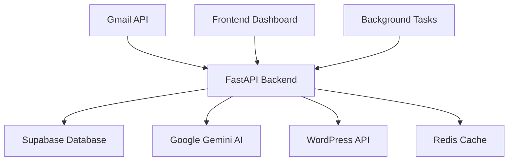

# 🚀 RecifeMais Conteúdo - Cofundador de Conteúdo Estratégico

Sistema de automação inteligente de conteúdo para o portal RecifeMais.com.br, utilizando IA para processar emails de assessoria e gerar conteúdo otimizado.

## 📋 Visão Geral

O **RecifeMais Conteúdo** é um "Cofundador de Conteúdo Estratégico" que automatiza o processo de criação de conteúdo jornalístico, desde a captura de emails de assessoria até a publicação de posts otimizados no WordPress.

### 🎯 Principais Funcionalidades

- **📧 Captura Automática**: Integração com Gmail API para capturar emails de assessorias
- **🤖 Processamento IA**: Análise e geração de conteúdo usando Google Gemini 2.0
- **📝 Criação Automática**: Geração de rascunhos otimizados para SEO
- **🔄 Anti-Duplicatas**: Sistema inteligente para evitar conteúdo repetido
- **📊 Dashboard**: Interface para monitoramento e gestão
- **🎨 WordPress Integration**: Publicação automática de rascunhos

## 🛠️ Stack Tecnológica

### Backend
- **FastAPI** - API REST moderna e performática
- **Python 3.9+** - Linguagem principal
- **Supabase** - Database PostgreSQL com recursos avançados
- **Redis** - Cache e filas de processamento

### IA & APIs
- **Google Gemini 2.0** - Processamento de linguagem natural
- **Gmail API** - Captura de emails
- **WordPress API** - Publicação de conteúdo
- **pgvector** - Embeddings e busca semântica

### Frontend (Planejado)
- **Next.js 14** - Framework React moderno
- **TailwindCSS** - Estilização utility-first
- **shadcn/ui** - Componentes elegantes

## 🚀 Quick Start

### Pré-requisitos
```bash
Python 3.9+
Node.js 18+ (para frontend)
Conta no Supabase
Conta no Google Cloud Console
Credenciais WordPress
```

### Instalação

1. **Clone o repositório**
```bash
git clone https://github.com/seu-usuario/app-conteudo-recifemais.git
cd app-conteudo-recifemais
```

2. **Instale as dependências**
```bash
pip install -r requirements.txt
```

3. **Configure as variáveis de ambiente**
```bash
cp config_example.env .env
# Edite o arquivo .env com suas credenciais
```

4. **Execute o servidor**
```bash
cd backend
PYTHONPATH=. python -m uvicorn main:app --host 0.0.0.0 --port 8001 --reload
```

### Configuração das APIs

#### Gmail API
1. Acesse o [Google Cloud Console](https://console.cloud.google.com/)
2. Crie um projeto e ative a Gmail API
3. Configure OAuth2 e baixe as credenciais
4. Execute: `python setup_gmail.py`

#### Supabase
1. Crie um projeto no [Supabase](https://supabase.com/)
2. Configure as tabelas usando os schemas em `/database/schemas/`
3. Adicione as credenciais no `.env`

## 📊 Arquitetura



## 🔧 Endpoints Principais

| Endpoint | Método | Descrição |
|----------|--------|-----------|
| `/health` | GET | Status do sistema |
| `/gmail/fetch-emails` | POST | Capturar emails |
| `/process-email` | POST | Processar email com IA |
| `/emails` | GET | Listar emails processados |
| `/wordpress/posts` | GET | Listar posts WordPress |

## 📈 ROI e Benefícios

### Economia de Tempo
- **15-25 horas/semana** economizadas
- **Payback < 1 mês** 
- **ROI 300-500%** no primeiro ano

### Qualidade do Conteúdo
- SEO otimizado automaticamente
- Consistência editorial
- Detecção de tendências
- Sugestões proativas de pautas

## 🌟 Funcionalidades Avançadas

### Cache Inteligente Multinível
- Redis para dados frequentes
- Supabase para persistência
- Embeddings para busca semântica

### Sistema de Priorização
- Análise de relevância automática
- Categorização inteligente
- Agendamento de publicações

### Monitoramento e Analytics
- Métricas de performance
- Custos de IA em tempo real
- Relatórios de produtividade

## 🔐 Segurança

- OAuth2 para todas as APIs
- Variáveis de ambiente para credenciais
- Rate limiting e validação de entrada
- Logs auditáveis

## 📋 Roadmap

### Fase 1 (Atual) - MVP Core ✅
- [x] Integração Gmail + IA + WordPress
- [x] Sistema anti-duplicatas
- [x] API REST completa
- [x] Cache inteligente

### Fase 2 - Inteligência Estratégica 🔄
- [ ] Dashboard completo
- [ ] RAG com knowledge base
- [ ] Google Analytics integration
- [ ] Sistema de agendamento

### Fase 3 - Experiência Avançada 📅
- [ ] Frontend React completo
- [ ] Mobile app
- [ ] Integração redes sociais
- [ ] AI-powered insights

## 🤝 Contribuição

1. Fork o projeto
2. Crie uma branch (`git checkout -b feature/nova-funcionalidade`)
3. Commit suas mudanças (`git commit -m 'Adiciona nova funcionalidade'`)
4. Push para a branch (`git push origin feature/nova-funcionalidade`)
5. Abra um Pull Request

## 📄 Licença

Este projeto está sob a licença MIT. Veja o arquivo [LICENSE](LICENSE) para mais detalhes.

## 📞 Contato

**Deyvson Freire** - Fundador RecifeMais
- Email: contato@recifemais.com.br
- Site: [recifemais.com.br](https://recifemais.com.br)

---

⭐ **Desenvolvido com ❤️ para revolucionar o jornalismo local em Pernambuco** 